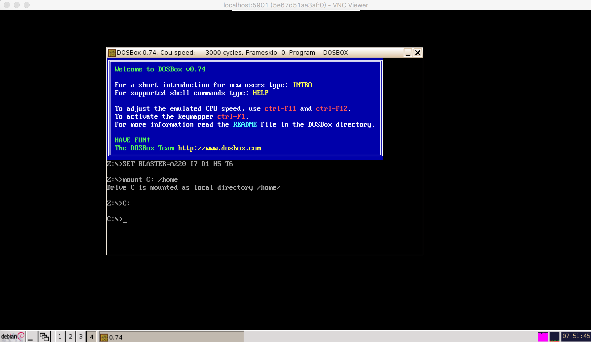
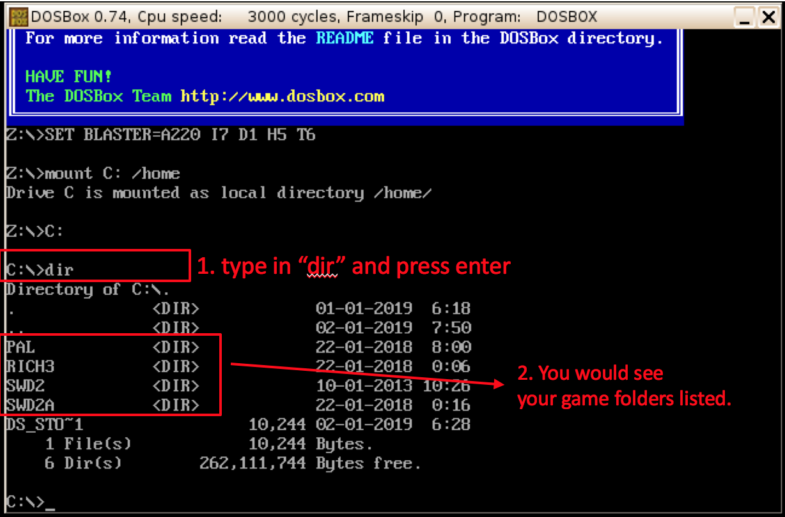

<h1 align="center">dosbox</h1>

<p align="center">Your Universal DOS Game Console by Docker</p>


## Installation & run

* Step 1. Install `docker` by following [Docker official installation guide](https://docs.docker.com/install/).
Docker is cross-platform so you can run **xserver** on Mac OSX / Linux / Windows.

* Step 2. Download the image, run
```
$ docker pull weichuntsai/xserver:1.0
$ docker pull weichuntsai/dosbox:1.0
```

* Step 3. Install a VNC viewer. I recommend [RealVNC](https://www.realvnc.com/en/connect/download/viewer/).

* Step 4. Initialize the **xserver** container, the command is as follows:
```
$ docker run --name mydisplay -e VNC_PASSWORD=1234 -p 5901:5900 weichuntsai/xserver:1.0
```
For other scenarios of this step, please refer to [xserver README.md](https://github.com/weichuntsai0217/xserver/blob/master/README.md)

* Step 5. Initialize the **dosbox** container with link to **xserver** container
(assume you want to name the dosbox container as `mydosgame` and your DOS game folders are in the `/oldgames` of your host computer),
please run
```
$ docker run --name mydosgame -dt -v /oldgames:/home --link mydisplay:xserver --volumes-from mydisplay weichuntsai/dosbox:1.0
```

* Step 6. Setup authentication cookie in the container `mydosgame` and run the command `dosbox`
```
$ docker exec -it mydosgame bash
$ chmod 755 /setup-xclient.sh; /setup-xclient.sh xserver; source ${HOME}/.bashrc
$ dosbox
```

* Step 7. Open your VNC viewer in the host computer (assume you initialize **xserver** like Step 4),
connect to `localhost:5901` and type in the password `1234`,
then you can see your dosbox console window inside the VNC viewer window like the following figure:


* Step 8. Type in `dir` in the dosbox console window, and you would see your game folders. Then you just use `cd ${game_folder}`
to enter into the folder and find the right executable you have to run (I assume you know what to run).

